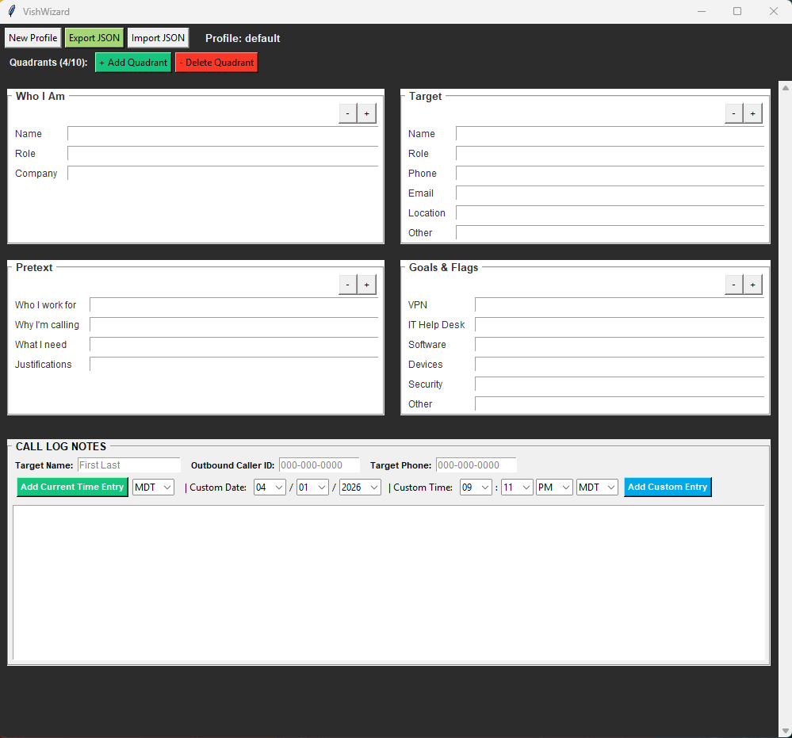
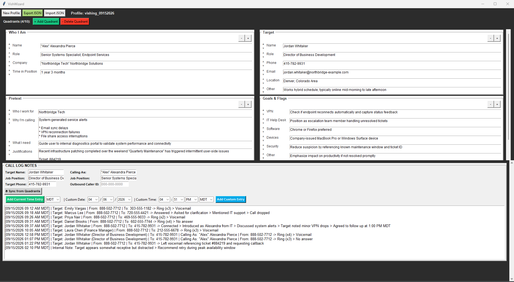
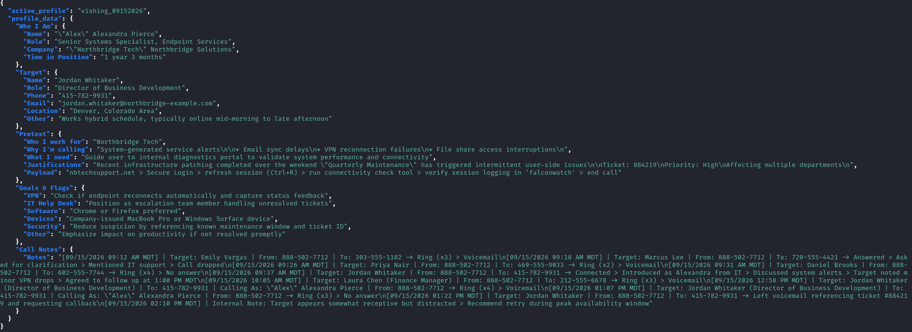

# VishWizard
Tool for helping Red Team Operators, Social Engineer Penetration Testers, and Cyber Security Professionals during vishing campaigns. This tool assist in framing a pretext before a call and keeping notes during an active call.

## Initial Load-up

## Example Usage 

### Usage for building and tracking pretext creation during live calls.

## JSON Export Example 

